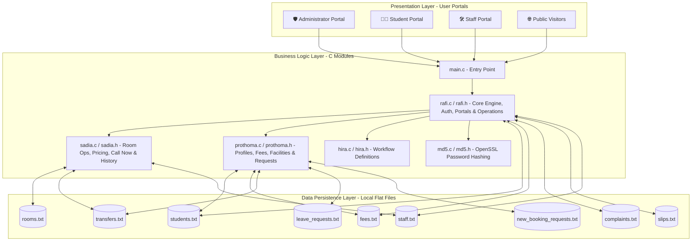

<div align="center">

# 🏛️ University Hostel Management System
### Department of Software Engineering • Daffodil International University (DIU)
**Capstone Project 4th Semester**

[](https://en.wikipedia.org/wiki/C99)
[](https://gcc.gnu.org/)
[](https://daffodilvarsity.edu.bd/)
[-orange?style=for-the-badge)]()
[](https://www.openssl.org/)
[](LICENSE)

---

</div>

## 📑 Table of Contents
- [📌 Executive Summary](#-executive-summary)
- [👥 Team Members & Contribution Matrix](#-team-members--contribution-matrix)
- [🏗️ System Architecture & Data Storage](#️-system-architecture--data-storage)
- [💾 Data Persistence & File Schema](#-data-persistence--file-schema)
- [🔒 Password Security & Hashing](#-password-security--hashing)
- [🌟 Key Functional Modules & SRS Mapping](#-key-functional-modules--srs-mapping)
- [🔄 User Workflow & Role Interactions](#-user-workflow--role-interactions)
- [🚀 Compilation & Execution Guide](#-compilation--execution-guide)
- [📁 Repository Organization](#-repository-organization)

---

## 📌 Executive Summary

The **DIU Hostel Management System** is a modular, lightweight, localized Command Line Interface (CLI) software application engineered in standard C (C99). Developed as a core Capstone Project for the Department of Software Engineering at Daffodil International University, the system automates end-to-end hostel operations including student onboarding, room allocations with pricing, real-time vacancy tracking, financial billing cycles, maintenance complaint management, room transfer requests, leave processing, and public visitor utilities.

> [!NOTE]
> **Modular Multi-File Architecture**  
> The application is cleanly structured into domain-specific source (`.c`) and header (`.h`) files assigned to team contributors. It operates with **zero external database server dependencies** (No SQL/NoSQL), relying on native C standard library file I/O operations for data persistence alongside OpenSSL for password security.

---

## 👥 Team Members & Contribution Matrix

| Contributor | Student ID | Workload Share | Core Functional Responsibilities & Contribution Scope |
|---|---|---|---|
| **Shaik Rezwan Ahmmed Rafi** <br>*(Lead Architect)* | `252-35-245` | **40%** | • **Core Storage Engine**: Database file initialization (`initialize_files`), record appending (`append_line`), auto-ID generation (`get_next_id`).<br>• **Input & Utility Layer**: Input handlers (`get_int`, `get_dbl`, `get_str`), screen pause controller.<br>• **Authentication & Portals**: Central landing portal (`login_portal`), Admin portal (`admin_portal`), Student portal (`student_portal`), Staff portal (`staff_portal`).<br>• **Student Operations**: Registration (`admin_register_student`) & Name search (`admin_search_student`).<br>• **Security**: OpenSSL MD5 password hashing integration (`get_password_md5`).<br>• **Financial & Complaints**: Fee recording (`admin_fee_ops`), payment slip logging (`student_submit_slip`), complaints engine (`staff_view_complaints`, `student_submit_complaint`, `staff_update_complaint`).<br>• **Analytics**: Executive summary dashboard (`admin_executive_summary`). |
| **Sadia Afrin Tabassum** | `252-35-268` | **25%** | • **Room Operations**: Room registration with monthly pricing (`admin_room_ops`).<br>• **Public Inspection**: Public room availability & price list (`public_view_rooms`).<br>• **Contact Center**: Hotline directory (`show_call_now`).<br>• **Allocation History**: Student room booking & transfer request history (`student_view_booking_history`).<br>• **Administration**: Staff registration (`admin_staff_ops`) & student record removal (`admin_student_ops`). |
| **Saima Tabachchum (Prothoma)** | `252-35-253` | **20%** | • **Profile & Fee Inspector**: Student profile view (`student_view_profile`) & fee status view (`student_view_fees`).<br>• **New Student Booking**: Submit room booking request for new students (`student_book_for_new`).<br>• **Amenities**: Interactive hostel facilities & amenities catalog (`show_facilities_list`).<br>• **Requests Subsystem**: Room transfer processing (`student_request_transfer`) & official leave processing (`student_request_leave`). |
| **Humaira Hira** | `252-35-542` | **15%** | • **Workflow Design**: Portal navigation structures & system request workflow design. |

---

## 🏗️ System Architecture & Data Storage

The system follows a modular 3-tier architecture linking user presentation portals, domain-specific C modules, and flat-file persistence storage.



---

## 💾 Data Persistence & File Schema

Data persistence is managed via custom delimited flat-files (`.txt`) using semicolon (`;`) separators:

| File Name | Primary Entity | Storage Format |
|---|---|---|
| `students.txt` | Student Records | `ID; Name; Department; Phone; PasswordHash; RoomNumber` |
| `rooms.txt` | Room Registry | `RoomNumber; Capacity; OccupiedBeds; Price` |
| `fees.txt` | Billing Accounts | `StudentID; MonthlyFee; ExtraFee; DueAmount; Status; PaymentDate` |
| `complaints.txt` | Maintenance Tickets | `ID; StudentID; Description; Status; Date` |
| `transfers.txt` | Transfer Requests | `RequestID; StudentID; TargetRoomNumber; Status` |
| `slips.txt` | Payment Slips | `SlipID; StudentID; TransactionNumber; Amount; Status` |
| `leave_requests.txt` | Leave Requests | `RequestID; StudentID; Status` |
| `staff.txt` | Staff Credentials | `ID; Name; Phone; Password` |
| `new_booking_requests.txt` | New Booking Requests | `RequestID; RecommenderID; NewStudentName; Dept; Phone; PreferredRoom; Status` |

---

## 🔒 Password Security & Hashing

Student passwords are systematically secured using OpenSSL MD5 hashing before being written to disk:

- **Header / Implementation**: [`md5.h`](file:///home/rafi/Daffodil/4th/Capstone/Capstone_Project_4th_Semester/md5.h) & [`md5.c`](file:///home/rafi/Daffodil/4th/Capstone/Capstone_Project_4th_Semester/md5.c)
- **Hash Length**: 128-bit digest rendered as a **32-character hexadecimal string** (+1 null terminator `\0` = 33-byte buffer).
- **Execution**:
  ```c
  void md5_hash(const char *input, char output_hex[33]) {
      unsigned char hash[16];
      MD5((const unsigned char *)input, strlen(input), hash);
      for (int i = 0; i < 16; i++) {
          sprintf(&output_hex[i * 2], "%02x", hash[i]);
      }
  }
  ```

---

## 🌟 Key Functional Features

| Module Icon | Feature Name | Description | Responsible Author |
|:---:|---|---|:---:|
| 🔐 | **MD5 Password Security** | Hashes student passwords using OpenSSL MD5 before storage in `students.txt`. | Rafi |
| 🧑‍🎓 | **Spaced Name Support** | Reads multi-word full names using `scanf(" %[^\n]", buf)`. | Rafi |
| 🛏️ | **Room Pricing** | Admin sets room prices when creating rooms; stored alongside capacity. | Sadia |
| 🌐 | **Public Room & Price Inspection** | Visitors view room availability and pricing prior to logging in. | Sadia |
| 📞 | **Call Now / Hotlines** | Direct contact hotline display (`01711111111`, `01998989898`). | Sadia |
| 📋 | **Booking History** | Students inspect active room allocations and transfer request logs. | Sadia |
| 📝 | **Book for New Student** | Existing students log room requests for new candidates. | Prothoma |
| 🏢 | **Facilities & Amenities List** | Public catalog of 24/7 Wi-Fi, Generator Backup, CCTV, Gym, Water Purifiers, etc. | Prothoma |
| 🔄 | **Room Transfer & Leave** | Log room transfer requests and official leave applications. | Prothoma |

---

## 🚀 Compilation & Execution Guide

### System Prerequisites
- **Compiler**: GCC (Linux / macOS / MinGW on Windows)
- **C Standard**: C99 or later
- **Dependencies**: OpenSSL Development Library (`libcrypto`)

#### Installing OpenSSL Development Library (if needed):
- **Ubuntu/Debian**: `sudo apt install libssl-dev`
- **Fedora/RHEL**: `sudo dnf install openssl-devel`
- **macOS**: `brew install openssl`

---

### Build & Run Instructions

```bash
# 1. Clone Repository
git clone https://github.com/Null-Spectra/Capstone_Project_4th_Semester.git
cd Capstone_Project_4th_Semester

# 2. Compile Modular C Source Files with OpenSSL (-lcrypto)
gcc -Wall main.c rafi.c sadia.c hira.c prothoma.c md5.c -lcrypto -o hostel_app

# 3. Execute Binary
./hostel_app
```

---

## 📁 Repository Organization

```
Capstone_Project_4th_Semester/
├── README.md               # System Documentation & Architecture Guide
├── .gitignore              # Git Exclusion Rules for Binaries & Database Text Files
├── LICENSE                 # Project License Agreement
├── main.c                  # Program Entry Point
├── rafi.h / rafi.c         # Core Engine, File Storage, Auth, Portals & Operations
├── sadia.h / sadia.c       # Room Operations, Pricing, Hotline & Booking History
├── prothoma.h / prothoma.c # Profile, Fees, New Student Requests, Facilities & Transfers
├── hira.h / hira.c         # Request Workflow Module
├── md5.h / md5.c           # OpenSSL MD5 Password Hashing Module
└── backup/                 # Historical Monolithic Backup (perfect_main.c)
```

---

<div align="center">

**Daffodil International University (DIU)**  
*Department of Software Engineering • Faculty of Science & Information Technology*

</div>