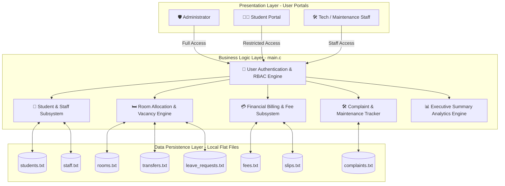
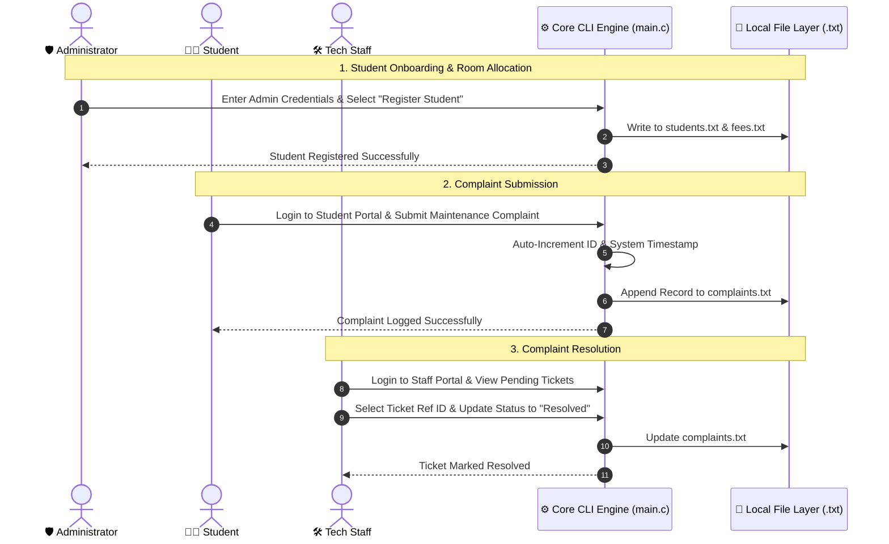

<div align="center">

# 🏛️ Hostel Management System
### Department of Software Engineering • Daffodil International University (DIU)
**Capstone Project 4th Semester (`main.c`)**

[](https://en.wikipedia.org/wiki/C99)
[](https://gcc.gnu.org/)
[](https://daffodilvarsity.edu.bd/)
[-orange?style=for-the-badge)](srs.md)
[](LICENSE)

---

</div>

## 📑 Table of Contents
- [📌 Executive Summary](#-executive-summary)
- [👥 Team Members & Contribution Matrix](#-team-members--contribution-matrix)
- [🏗️ System Architecture & Data Storage](#️-system-architecture--data-storage)
- [💾 Data Persistence & File Schema](#-data-persistence--file-schema)
- [🌟 Key Functional Modules & SRS Mapping](#-key-functional-modules--srs-mapping)
- [🔄 User Workflow & Role Interactions](#-user-workflow--role-interactions)
- [⚡ Technical Design & Safety Mechanisms](#-technical-design--safety-mechanisms)
- [🚀 Compilation & Execution Guide](#-compilation--execution-guide)
- [📁 Repository Organization](#-repository-organization)

---

## 📌 Executive Summary

The **DIU Hostel Management System** is an enterprise-grade, lightweight, localized Command Line Interface (CLI) software application engineered natively in standard C (`main.c`). Developed as a core Capstone Project for the Department of Software Engineering at Daffodil International University, the system automates end-to-end hostel operations including student onboarding, room allocations, real-time vacancy tracking, financial billing cycles, maintenance complaint management, room transfer requests, and leave processing.

> [!IMPORTANT]
> **Single-File Architectural Constraint (`main.c`)**
> Per strict academic guidelines, the entire application engine—encompassing data structures, database I/O subroutines, authentication security, role-based dashboards, and business logic—is encapsulated cleanly inside a single source file (`main.c`). It operates with **zero external database dependencies** (No SQL/NoSQL), relying exclusively on native C standard library file I/O operations for data persistence.

---

## 👥 Team Members & Contribution Matrix

> [!NOTE]
> Function prototypes and implementation sections in `main.c` are explicitly structured and grouped by module authors for academic contribution traceability.

| Contributor | Student ID | Workload Share | Core Functional Responsibilities & Contribution Scope |
|---|---|---|---|
| **Shaik Rezwan Ahmmed Rafi** <br>*(Lead Architect)* | `252-35-245` | **37.7%** | • **Section 1**: Core Storage Engine, database file initialization & I/O helpers.<br>• **Authentication Router**: Central `login_portal()` handler.<br>• **Financial Operations**: Manual payment recording (`admin_fee_ops()`) & defaulters list.<br>• **Analytics Engine**: System-wide `admin_executive_summary()` reporting. |
| **Sadia Afrin Tabassum** | `252-35-268` | **28.5%** | • **Section 2**: Student registration workflow (`admin_register_student()`).<br>• **Lookup Subsystems**: Student search by query (`admin_search_student()`).<br>• **Resource Management**: Room configuration (`admin_room_ops()`) & staff registration.<br>• **Maintenance Operations**: Ticket resolution (`staff_update_complaint()`). |
| **Humaira Hira** | `252-35-542` | **20.0%** | • **Section 3**: Portal navigation controllers (`admin_portal()`, `student_portal()`, `staff_portal()`).<br>• **Request Services**: Room transfer requests (`student_request_transfer()`).<br>• **Financial Submissions**: Payment slip logging (`student_submit_slip()`).<br>• **Leave Subsystem**: Official leave processing (`student_request_leave()`). |
| **Saima Tabachchum (Prothoma)** | `252-35-253` | **13.8%** | • **Section 4**: Student profile inspector (`student_view_profile()`).<br>• **Fee Status Inspector**: Student fee status view (`student_view_fees()`).<br>• **Complaints Inspector**: Global complaints list display (`staff_view_complaints()`).<br>• **Issue Lodging**: Maintenance complaint submission (`student_submit_complaint()`). |

---

## 🏗️ System Architecture & Data Storage

The application employs a layered modular architecture operating entirely within CLI space. The core engine mediates between user role interfaces and the flat-file persistence storage layer.



---

## 💾 Data Persistence & File Schema

Data persistence is managed via custom formatted flat-files (`.txt`) using formatted string records separated by standard delimiters (`;`).

| File Name | Primary Entity | Storage Format |
|---|---|---|
| `students.txt` | Student Records | `ID; Name; Department; Phone; Password; RoomNumber` |
| `rooms.txt` | Room Registry | `RoomNumber; Capacity; OccupiedBeds` |
| `fees.txt` | Billing Accounts | `StudentID; MonthlyFee; ExtraFee; DueAmount; Status; PaymentDate` |
| `complaints.txt` | Maintenance Tickets | `ID; StudentID; Description; Status; Date` |
| `transfers.txt` | Transfer Requests | `RequestID; StudentID; TargetRoomNumber; Status` |
| `slips.txt` | Payment Slips | `SlipID; StudentID; TransactionNumber; Amount; Status` |
| `leave_requests.txt` | Leave Requests | `RequestID; StudentID; Status` |
| `staff.txt` | Staff Credentials | `ID; Name; Phone; Password` |

---

## 🌟 Key Functional Modules & SRS Mapping

The implementation directly satisfies the requirements specified in the project SRS Document:

| Module Icon | Module Name | Capability Overview | SRS Ref. | Priority |
|:---:|---|---|:---:|:---:|
| 🔐 | **Authentication & Security** | Role-based authentication routing for Admin, Student, and Staff dashboards. | FR001, FR002 | `MUST` |
| 🧑‍🎓 | **Student Onboarding** | Student registration, duplicate ID prevention, profile edits, and record deletions. | FR003 - FR007 | `MUST` |
| 🛏️ | **Room & Occupancy** | Room creation, bed allocation, real-time vacancy tracking, and capacity enforcement. | FR008 - FR012 | `MUST` |
| 💳 | **Financial Management** | Manual payment logging, fee defaulter tracking, financial summaries, and monthly billing resets. | FR013 - FR017 | `MUST` |
| 🔄 | **Room Transfer Subsystem** | Student room transfer requests, administrative review, and automatic fee calculation. | FR018, FR019 | `COULD` |
| 🛠️ | **Maintenance & Complaints** | Maintenance complaint lodging, global complaint log viewing, and ticket status updating. | FR020 - FR022 | `MUST` |
| 🚪 | **Leave & De-allocation** | Official leave request submission and automated room de-allocation processing. | FR023, FR024 | `COULD` |
| 📊 | **Executive Summary & I/O** | Automatic missing storage file creation and system-wide aggregate summary reports. | FR025 - FR027 | `MUST` |

---

## 🔄 User Workflow & Role Interactions



---

## ⚡ Technical Design & Safety Mechanisms

### 1. Robust Input Sanitization
`get_str()` cleans trailing newline characters and handles inputs cleanly using `fgets()`:
```c
if (fgets(buf, size, stdin)) {
    buf[strcspn(buf, "\r\n")] = '\0';
}
```

### 2. Transactional File Swapping Pattern
To prevent data corruption during record updates or deletions, modified content is written to a temporary file (`temp.txt`) before performing a safe replacement:
```c
fclose(src);
fclose(tmp);
remove("fees.txt");
rename("temp.txt", "fees.txt");
```

---

## 🚀 Compilation & Execution Guide

### System Prerequisites
- **Compiler**: GCC 4.8+ (Linux/macOS) or MinGW GCC (Windows)
- **Standard**: C99 or later
- **Terminal**: Standard ANSI terminal

### Build & Execution Instructions

```bash
# Clone Repository
git clone https://github.com/Null-Spectra/Capstone_Project_4th_Semester.git
cd Capstone_Project_4th_Semester

# Compile main.c with GCC (C99 standard)
gcc -Wall -Wextra -std=c99 main.c -o main

# Run Executable
./main
```

---

## 📁 Repository Organization

```
Capstone_Project_4th_Semester/
├── README.md               # System Documentation & Architecture Overview
├── .gitignore              # Configured Git Exclusion Rules for Executables & Data Files
├── LICENSE                 # License Agreement
├── srs.md                  # Complete Software Requirements Specification (SRS)
└── main.c                  # CAPSTONE CORE: Single-File C Engine (579 Lines of C99 Code)
```

---

<div align="center">

**Daffodil International University (DIU)**  
*Department of Software Engineering • Faculty of Science & Information Technology*

</div>