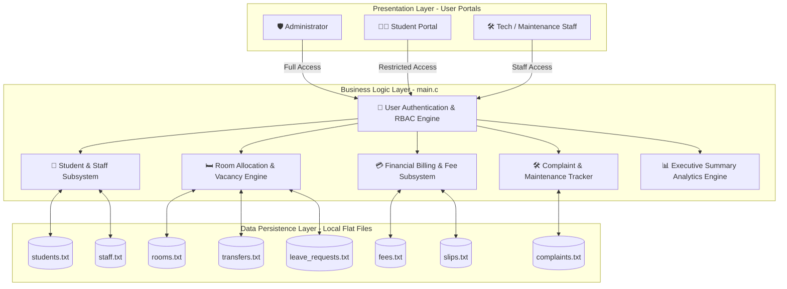
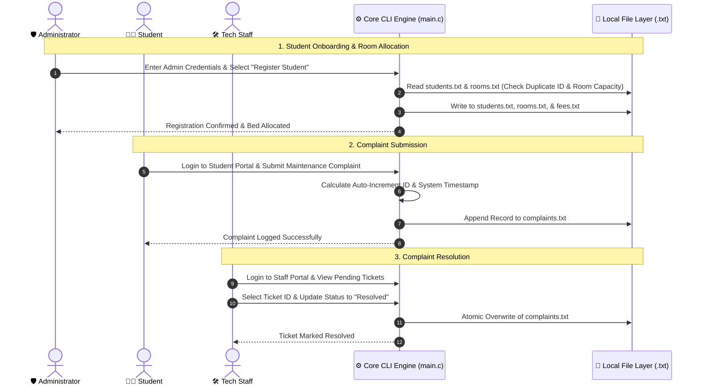

<div align="center">

# 🏛️ Hostel Management System
### Department of Software Engineering • Daffodil International University (DIU)
**Capstone Project 4th Semester (`main.c`)**

[](https://en.wikipedia.org/wiki/C99)
[](https://gcc.gnu.org/)
[](https://daffodilvarsity.edu.bd/)
[-orange?style=for-the-badge)](srs.md)
[](LICENSE)

---

</div>

## 📑 Table of Contents
- [📌 Executive Summary](#-executive-summary)
- [👥 Team Members & Contribution Matrix](#-team-members--contribution-matrix)
- [🏗️ System Architecture & Data Storage](#️-system-architecture--data-storage)
- [💾 Data Persistence & File Schema](#-data-persistence--file-schema)
- [🌟 Key Functional Modules & SRS Mapping](#-key-functional-modules--srs-mapping)
- [🔄 User Workflow & Role Interactions](#-user-workflow--role-interactions)
- [⚡ Technical Design & Safety Mechanisms](#-technical-design--safety-mechanisms)
- [🚀 Compilation & Execution Guide](#-compilation--execution-guide)
- [📁 Repository Organization](#-repository-organization)
- [📜 License & Academic Disclosure](#-license--academic-disclosure)

---

## 📌 Executive Summary

The **DIU Hostel Management System** is an enterprise-grade, lightweight, localized Command Line Interface (CLI) software application engineered natively in standard C (`main.c`). Developed as a core Capstone Project for the Department of Software Engineering at Daffodil International University, the system automates end-to-end hostel operations including student onboarding, room allocations, real-time vacancy tracking, financial billing cycles, maintenance complaint management, room transfer requests, and leave processing.

> [!IMPORTANT]
> **Single-File Architectural Constraint (`main.c`)**
> Per strict academic guidelines, the entire application engine—encompassing data structures, database I/O subroutines, authentication security, role-based dashboards, and business logic—is encapsulated cleanly inside a single source file (`main.c`). It operates with **zero external database dependencies** (No SQL/NoSQL), relying exclusively on native C standard library file I/O operations for data persistence.

---

## 👥 Team Members & Contribution Matrix

> [!NOTE]
> All core functions in `main.c` are explicitly tagged by module authors to guarantee clear contribution traceability and academic integrity.

| Contributor | Student ID | Workload Share | Core Functional Responsibilities & Contribution Scope |
|---|---|---|---|
| **Shaik Rezwan Ahmmed Rafi** <br>*(Lead Architect)* | `252-35-245` | **46.9%** | • **Core Storage Engine**: Database initialization & file I/O handlers.<br>• **Authentication Engine**: Password verification & role-based routing.<br>• **Financial Operations**: Manual payment logging, fee defaulters list, & monthly billing reset.<br>• **Cascading Record Cleaner**: Multi-file relational deletion routines.<br>• **Robust I/O Utilities**: Input buffer sanitization & automated date calculation. |
| **Sadia Afrin Tabassum** | `252-35-268` | **Product Subsystems** | • **Data Lookup Subsystems**: Student search by exact ID & partial name matching.<br>• **Room Administration**: Bed allocation verification & room registry routines.<br>• **Staff Management**: Technician account creation, listing, & deletion services. |
| **Humaira Hira** | `252-35-542` | **Product Subsystems** | • **System Portals**: Navigation controllers for Admin, Student, & Staff dashboards.<br>• **Student Registration**: Onboarding workflow & default fee generation.<br>• **Executive Summary**: High-level statistical report generator for administrators.<br>• **Transfer Request Processor**: Room transfer approval & denial workflows. |
| **Saima Tabachchum (Prothoma)** | `252-35-253` | **Product Subsystems** | • **Data Structure Schemas**: Struct definitions for all 8 system entities.<br>• **CLI Interface Utilities**: Terminal screen clearing & visual UI divider formatting.<br>• **Student Services**: Complaint lodging, payment slip submissions, & leave requests.<br>• **Maintenance Portal**: Staff ticket viewing & complaint status update interface. |

---

## 🏗️ System Architecture & Data Storage

The application employs a layered modular architecture operating entirely within CLI space. The core engine mediates between user role interfaces and the flat-file persistence storage layer.



---

## 💾 Data Persistence & File Schema

Data persistence is managed via custom formatted flat-files (`.txt`) using formatted string records separated by standard delimiters (`;`).

| File Name | Entity Struct | Primary Fields & Storage Format |
|---|---|---|
| `students.txt` | `struct Student` | `ID; Name; Department; Phone; Password; RoomNumber` |
| `rooms.txt` | `struct Room` | `RoomNumber; Capacity; OccupiedBeds` |
| `fees.txt` | `struct Fee` | `StudentID; MonthlyFee; ExtraFee; DueAmount; Status; PaymentDate` |
| `complaints.txt` | `struct Complaint` | `ID; StudentID; Description; Status; Date` |
| `transfers.txt` | `struct RoomTransfer` | `RequestID; StudentID; TargetRoomNumber; Status` |
| `slips.txt` | `struct PaymentSlip` | `SlipID; StudentID; TransactionNumber; Amount; Status` |
| `leave_requests.txt` | `struct LeaveRequest` | `RequestID; StudentID; Status` |
| `staff.txt` | `struct Staff` | `ID; Name; Phone; Password` |

---

## 🌟 Key Functional Modules & SRS Mapping

The implementation directly satisfies the requirements specified in the project SRS Document:

| Module Icon | Module Name | Capability Overview | SRS Ref. | Priority |
|:---:|---|---|:---:|:---:|
| 🔐 | **Authentication & Security** | Role-based authentication routing for Admin, Student, and Staff dashboards. | FR001, FR002 | `MUST` |
| 🧑‍🎓 | **Student Onboarding** | Student registration, duplicate ID prevention, profile edits, and cascading deletions. | FR003 - FR007 | `MUST` |
| 🛏️ | **Room & Occupancy** | Room creation, bed allocation, real-time vacancy tracking, and capacity enforcement. | FR008 - FR012 | `MUST` |
| 💳 | **Financial Management** | Manual payment logging, fee defaulter tracking, financial summaries, and monthly billing resets. | FR013 - FR017 | `MUST` |
| 🔄 | **Room Transfer Subsystem** | Student room transfer requests, administrative review, and automatic fee calculation. | FR018, FR019 | `COULD` |
| 🛠️ | **Maintenance & Complaints** | Maintenance complaint lodging, global complaint log viewing, and ticket status updating. | FR020 - FR022 | `MUST` |
| 🚪 | **Leave & De-allocation** | Official leave request submission and automated room de-allocation processing. | FR023, FR024 | `COULD` |
| 📊 | **Executive Summary & I/O** | Automatic missing storage file creation and system-wide aggregate summary reports. | FR025 - FR027 | `MUST` |

---

## 🔄 User Workflow & Role Interactions



---

## ⚡ Technical Design & Safety Mechanisms

### 1. Robust Input Sanitization
To prevent terminal infinite loops caused by unexpected string characters during integer/double reading, `get_input_string()` uses `fgets()` combined with a stream buffer clearing loop:
```c
/* Clears lingering characters from stdin buffer */
int character;
while ((character = getchar()) != '\n' && character != EOF);
```

### 2. Transactional File Swapping Pattern
To prevent database file corruption during updates or deletions, data modifications write to a temporary file (`temp_*.txt`) before executing an atomic filesystem swap:
```c
fclose(source_file);
fclose(temporary_file);
remove("students.txt");
rename("temp_students.txt", "students.txt");
```

### 3. Cascading Relational Deletion
When an administrator deletes a student profile via `delete_student_all_records()`, the engine automatically purges corresponding entries across `students.txt`, `fees.txt`, `complaints.txt`, `transfers.txt`, `slips.txt`, and `leave_requests.txt`, while releasing allocated room beds in `rooms.txt`.

---

## 🚀 Compilation & Execution Guide

### System Prerequisites
- **Compiler**: GCC 4.8+ (Linux/macOS) or MinGW GCC (Windows)
- **Standard**: C99 or later
- **Terminal**: Any ANSI-compliant standard terminal

### Build Instructions

1. **Clone Repository**:
   ```bash
   git clone https://github.com/Null-Spectra/Capstone_Project_4th_Semester.git
   cd Capstone_Project_4th_Semester
   ```

2. **Compile Application**:
   ```bash
   # Standard compilation with C99 standard
   gcc -Wall -Wextra -std=c99 main.c -o hostel_management

   # Or quick compilation
   gcc main.c -o main
   ```

3. **Execute CLI Program**:
   ```bash
   # On Linux / macOS:
   ./main

   # On Windows Command Prompt / PowerShell:
   main.exe
   ```

---

## 📁 Repository Organization

```
Capstone_Project_4th_Semester/
├── README.md               # Professional Architecture & Project Documentation
├── .gitignore              # Configured Git Exclusion Rules for Executables & Data Files
├── LICENSE                 # License Agreement
└── main.c                  # CAPSTONE CORE: Single-File C Engine
```

---

<div align="center">

**Daffodil International University (DIU)**  
*Department of Software Engineering • Faculty of Science & Information Technology*

</div>