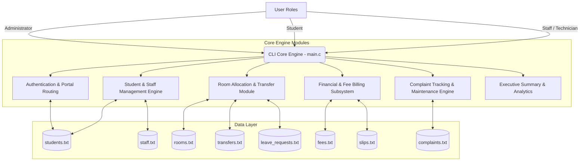
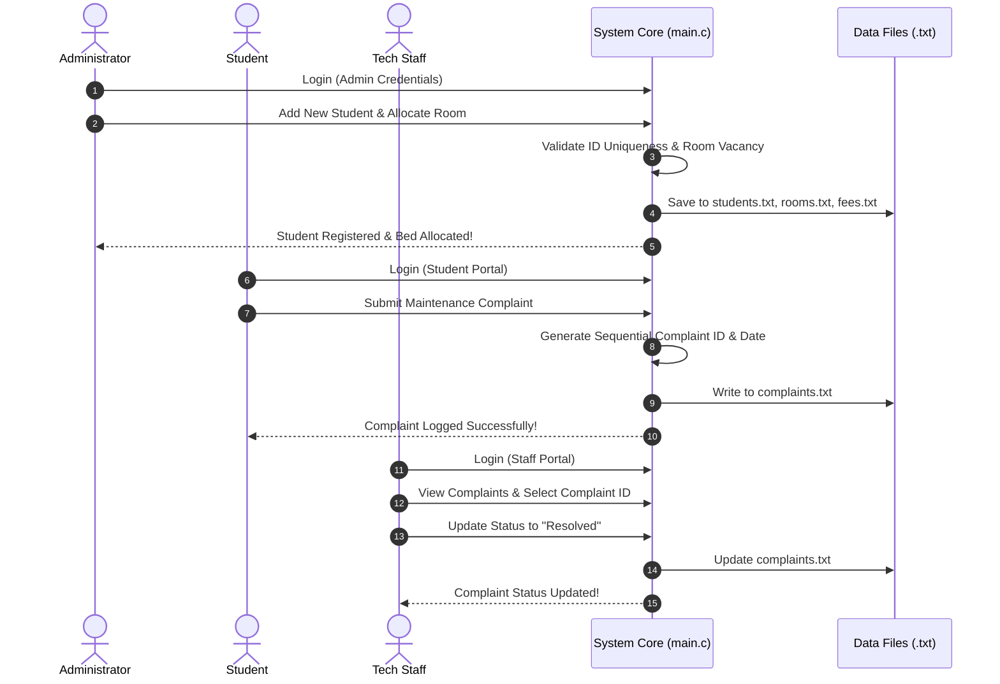

<div align="center">

# Daffodil International University (DIU)
### Capstone Project: Hostel Management System (`main.c`)


</div>

---

## 👥 Group Project Team Members & Product Functions

| Member | Student ID | Specific Product Functions & Contribution Area |
|---|---|---|
| **Shaik Rezwan Ahmmed Rafi** | `[252-35-245]` | • **Core Engine & Data Initialization**: Automatic creation and management of persistent data files.<br>• **User Authentication & Login Portal**: Credential verification and role-based portal routing (Admin, Student, Staff).<br>• **Billing & Fee Operations**: Record manual payments, reset monthly billing cycles, view fee defaulters, and generate financial summaries.<br>• **Student Records Cleanup**: Cascading deletion of student records across all database files.<br>• **Input & I/O Utilities**: Safe string/numeric input buffer clearing and date formatting. |
| **Sadia Afrin Tabassum** | `[252-35-268]` | • **Student & Staff Verification**: Helper functions for record existence checks and name resolution.<br>• **Room Operations**: Administrative room management and bed occupancy tracking.<br>• **Staff Administration**: Staff account creation, listing, and deletion subroutines.<br>• **Student Search Subsystem**: Exact ID and partial name search utilities for administrators. |
| **Hira** | `[252-35-542]` | • **Portal Dashboards**: Navigation logic for Admin, Student, and Staff portals.<br>• **Student Registration**: Register new student profiles with baseline fee generation.<br>• **Executive Summary Report**: High-level statistical report detailing total students, vacancies, pending complaints, and unpaid dues.<br>• **Room Transfer Management**: Handling room transfer requests and approval processing.<br>• **Complaint Resolution**: Interface for staff to update complaint statuses. |
| **Saima Tabachchum (Prothoma)** | `[252-35-253]` | • **Data Structure Definitions**: Design of C structs for Student, Room, Fee, Complaint, RoomTransfer, PaymentSlip, LeaveRequest, and Staff.<br>• **UI Utilities**: Terminal screen clearing (`cls`/`clear`) and visual separator line rendering.<br>• **Student Request Services**: Submitting maintenance complaints, payment transaction slips, and leave requests.<br>• **Staff Complaint Viewing**: Interface for staff to review pending maintenance tickets. |

---

## 📌 Executive Summary

The **DIU Hostel Management System** is a localized, lightweight, high-performance console application built natively in C (`main.c`). Designed specifically for university and private hostel facility operations as a Capstone Project, it automates student registrations, bed allocations, room transfer workflows, fee billings, payment slip verification, maintenance complaint tracking, and staff management. Operating entirely without external database servers or cloud infrastructure, the system achieves data persistence through local file handling (`.txt` / `.dat` binary structures).

---

## 🏗️ System Architecture

<div align="center">

</div>



---

## 🌟 Key Features & Functional Responsibility

| Module | Features & Capabilities | Contributor | Functional Requirements |
|---|---|---|---|
| 🔐 **Authentication & RBAC** | Role-based authentication and navigation portals for Admin, Student, and Staff | Rafi / Hira | FR001, FR002 |
| 🧑‍🎓 **Student Management** | Registration, duplicate ID prevention, searching, profile editing, and cascading record deletion | Rafi / Hira / Sadia | FR003, FR004, FR005, FR006, FR007 |
| 🛏️ **Room Operations** | Room creation, capacity enforcement, real-time bed vacancy calculation, and manual room reassignment | Rafi / Sadia | FR008, FR009, FR010, FR011, FR012 |
| 💳 **Financial & Billing** | Manual payment logging, defaulter identification, monthly fee reset cycle, payment slip submission & verification | Rafi / Prothoma | FR013, FR014, FR015, FR017 |
| 🔄 **Room Transfer Engine** | Student transfer requests, administrative approval/rejection, and automated transfer fee application | Rafi / Hira | FR018, FR019 |
| 🛠️ **Complaint Tracking** | Lodging maintenance complaints with timestamping, global complaint viewing, and status updating (Pending, In Progress, Resolved) | Prothoma / Hira | FR020, FR021, FR022 |
| 🚪 **Leave & Check-out** | Submission of official leave requests and automated room de-allocation upon administrative approval | Rafi / Prothoma | FR023, FR024 |
| 📊 **Executive Summary** | Automatic system file initialization and aggregate statistics report generation | Rafi / Hira | FR025, FR026, FR027 |

---

## 🔄 User Workflow Diagram



---

## 🚀 Getting Started

### Prerequisites
- **GCC Compiler**: `sudo apt install -y gcc` (Linux) or MinGW (Windows)
- **C Standard**: C99 compliant environment

### Compilation & Execution

To build and run the project:
```bash
# Compile using GCC
gcc -Wall -Wextra -std=c99 main.c -o main

#or easily

gcc main.c -o main

# Execute CLI System
./main
```

---

## 📁 Repository File Structure

```
Capstone_Project_4th_Semester/
├── README.md               # System Documentation & Architecture Overview
├── .gitignore              # Git Ignore Rules for Executables & Data Files
├── LICENSE                 # License File
└── main.c                  # CAPSTONE CORE: C Hostel Management Engine
```

---

<div align="center">
  <b>Daffodil International University (DIU)</b>
  <p>• Department of Software Engineering</p>
</div>