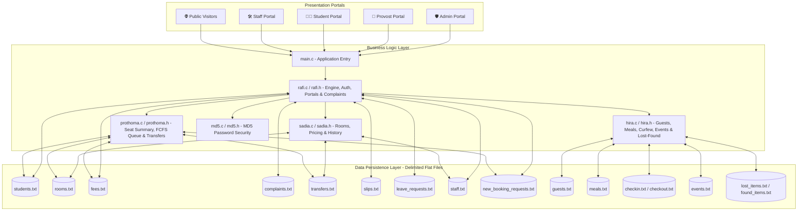
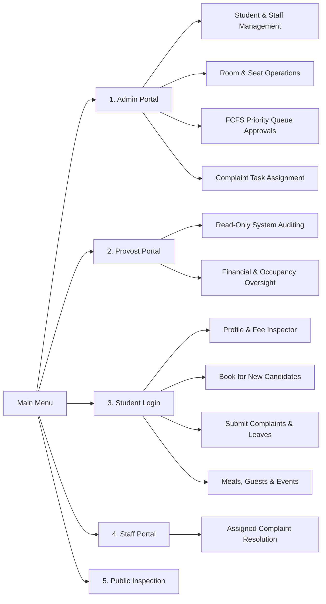

<div align="center">

# 🏛️ University Hostel Management System
### Department of Software Engineering • Daffodil International University (DIU)
**Capstone Project 4th Semester**

[](https://en.wikipedia.org/wiki/C99)
[](https://gcc.gnu.org/)
[](https://daffodilvarsity.edu.bd/)
[-orange?style=for-the-badge)]()
[](https://en.wikipedia.org/wiki/MD5)
[](LICENSE)

---

</div>

## 📑 Table of Contents
- [📌 Executive Summary](#-executive-summary)
- [👥 Team Members & Contribution Matrix](#-team-members--contribution-matrix)
- [✨ Key System Features](#-key-system-features)
- [🏗️ System Architecture](#️-system-architecture)
- [💾 Data Persistence & File Schema](#-data-persistence--file-schema)
- [🔒 Password Security & Hashing](#-password-security--hashing)
- [🔄 User Roles & Portals](#-user-roles--portals)
- [🚀 Compilation & Execution Guide](#-compilation--execution-guide)
- [📁 Repository Organization](#-repository-organization)

---

## 📌 Executive Summary

The **DIU Hostel Management System** is a high-performance, modular Command Line Interface (CLI) software application engineered in C (C99). Developed as the final Capstone Project for the Department of Software Engineering at Daffodil International University (DIU), the system provides an end-to-end management platform for hostel administration.

Key capabilities include student onboarding, room allocation & pricing, real-time seat availability tracking, FCFS priority queue request processing, complaint lifecycle assignment (Student → Admin → Staff), financial ledger & payment tracking, leave date management, curfew time restriction checks, meal & room delivery systems, event requests, lost & found matching, and a read-only Provost/Superadmin oversight dashboard.

> [!NOTE]
> **Zero External Database Dependency (Flat-File Engine)**  
> The system operates without external database servers (No SQL/NoSQL engine required). All data is persisted using custom semicolon and space-delimited flat-files processed via native C File I/O operations.

---

## 👥 Team Members & Contribution Matrix

| Contributor | Student ID | Workload Share | Core Functional Responsibilities & Contribution Scope |
|---|---|---|---|
| **Shaik Rezwan Ahmmed Rafi** <br>*(Lead Architect)* | `252-35-245` | **35%** | • **Core Storage Engine**: Flat-file initialization (`initialize_files`), record appending (`append_line`), auto-increment ID generation (`get_next_id`).<br>• **Portals & Routing**: Central landing portal (`login_portal`), Administrator portal (`admin_portal`), Student portal (`student_portal`), Staff portal (`staff_portal`), and Provost / Superadmin portal (`provost_portal`).<br>• **Cross-Platform Utilities**: Dynamic terminal clearing (`clear_term`, `clear_screen`) and pause handlers (`pause_term`).<br>• **Student Operations**: Onboarding (`admin_register_student`), search (`admin_search_student`), and room-wise search (`admin_search_room`).<br>• **Security**: OpenSSL MD5 hash integration (`get_password_md5`).<br>• **Complaints Engine**: Task assignment workflow (`admin_view_complaints`, `admin_assign_complaint`, `staff_view_complaints`, `student_submit_complaint`, `staff_update_complaint`).<br>• **Provost Dashboard**: Read-only oversight handlers (`provost_view_all_students`, `provost_view_all_staff`, `provost_view_fee_records`). |
| **Sadia Afrin Tabassum** | `252-35-268` | **25%** | • **Room & Pricing**: Room registration with bed capacity & monthly pricing (`admin_room_ops`).<br>• **Public Inspection**: Room availability and pricing catalog (`public_view_rooms`).<br>• **Contact Center**: Official emergency hotline directory (`show_call_now`).<br>• **History Tracking**: Student room allocation & transfer request history (`student_view_booking_history`).<br>• **Staff & Student Operations**: Staff registration (`admin_staff_ops`) and student record deletion (`admin_student_ops`). |
| **Saima Tabachchum (Prothoma)** | `252-35-253` | **20%** | • **Profile & Fees**: Profile inspector (`student_view_profile`) and fee status viewer (`student_view_fees`).<br>• **Seat Availability Engine**: Real-time room seat availability summary (`show_available_seats_summary`).<br>• **New Student Booking**: Booking request submission with seat visibility (`student_book_for_new`).<br>• **FCFS Priority Queue Engine**: Admin First-Come First-Served priority queue viewer & approval engine (`admin_view_new_booking_requests_priority_queue`, `admin_approve_new_booking_request_priority_queue`).<br>• **Facilities & Transfers**: Facilities catalog (`show_facilities_list`) and room transfer request system (`student_request_transfer`). |
| **Humaira Hira** | `252-35-542` | **20%** | • **Guest Management**: Registration (`guest_register`), request inspection (`admin_view_guest_requests`), and approval (`admin_approve_guest`).<br>• **Meal Management**: Meal registration (`meal_register`), approval (`admin_approve_meal`), daily meal payments, meal chart, and room delivery requests (`admin_view_room_delivery_requests`).<br>• **Time Restriction & Curfew**: Gender-based curfew check-in (`student_checkin`), check-out (`student_checkout`), and late entry logs (`admin_view_late_entries`).<br>• **Event Management**: Event requests (`event_request`), inspection (`admin_view_event_requests`), and approval/rejection (`admin_approve_event`).<br>• **Lost & Found System**: Item reporting (`report_lost_item`, `report_found_item`), item searching (`search_item`), automated item matching (`check_item_match`), and return tracking (`admin_return_lost_item`). |

---

## ✨ Key System Features

### 1. 👑 Provost / Superadmin Portal (Read-Only Executive Oversight)
- **Default Credentials**: `username: superadmin` | `password: superadmin`
- Grants high-level university authorities read-only visibility into student directories, staff rosters, financial ledgers, complaint tickets, room occupancy, meal logs, guest requests, event applications, and late curfew entries.

### 2. 🛏️ Real-Time Seat Availability & Room-Wise Inspection
- Displays room-by-room capacity, occupied count, free beds available, and monthly pricing.
- Integrated into student booking workflows so candidates can inspect free seats before selecting a room.
- Detailed room search displays full resident profiles (Name, ID, Department, Phone) occupying any selected room.

### 3. ⏳ First-Come, First-Served (FCFS) Priority Queue Approvals
- New student booking requests and guest applications are queued in strict submission timestamp order.
- Admin views pending requests ranked by priority (`P-1`, `P-2`, ...).
- Approving a booking request automatically creates student credentials, allocates the selected room, and initializes fee records.

### 4. 🛠️ Complaint Lifecycle & Staff Assignment
- Students submit maintenance complaints directly to the Administrator.
- Admin views all incoming complaints and assigns them to specific staff members selected from the registered staff list (`staff.txt`).
- Staff members view their assigned tickets in the Staff Portal and mark them as `Resolved` upon completion.

### 5. 📅 Leave Request System with Date & Reason
- Allows students to log official leave applications specifying the intended leave date (`YYYY-MM-DD`) and justification.

### 6. 🕒 Gender-Based Curfew & Time Restriction Tracking
- Tracks student check-ins and check-outs.
- Enforces gender-sensitive curfew thresholds (e.g., 7:00 PM for Female students, 10:00 PM for Male students). Entries past curfew automatically log as `Late` for warden inspection.

### 7. 🔍 Automated Lost & Found Item Matching
- Students and finders log lost or found articles.
- The matching engine (`check_item_match`) scans reported items and automatically alerts users when lost and found descriptions align.

---

## 🏗️ System Architecture

The application is structured into domain-specific C modules coordinated through a central main loop:



---

## 💾 Data Persistence & File Schema

All database records are stored in ASCII flat-files delimited by semicolon (`;`) or space (` `):

| Database File | Purpose | Storage Record Format |
|---|---|---|
| `students.txt` | Registered Students | `ID; Name; Department; Phone; PasswordHash; RoomNumber` |
| `rooms.txt` | Room Registry | `RoomNumber; Capacity; OccupiedBeds; MonthlyPrice` |
| `fees.txt` | Student Financial Accounts | `StudentID; MonthlyFee; ExtraFee; DueAmount; Status; PaymentDate` |
| `complaints.txt` | Maintenance Tickets | `ID; StudentID; Description; Status; AssignedStaffID; Date` |
| `transfers.txt` | Room Transfer Requests | `RequestID; StudentID; TargetRoomNumber; Status` |
| `slips.txt` | Payment Slips | `SlipID; StudentID; TransactionID; Amount; Status` |
| `leave_requests.txt` | Leave Applications | `RequestID; StudentID; LeaveDate; Reason; Status` |
| `staff.txt` | Staff Accounts | `ID; Name; Phone; Password` |
| `new_booking_requests.txt` | New Candidate Requests | `RequestID; RecommenderID; Name; Department; Phone; PreferredRoom; Status` |
| `guests.txt` | Guest Registrations | `StudentID GuestName Relation Status` |
| `meals.txt` | Meal Applications | `StudentID Days [Delivery] [Room] [Charge] Status` |
| `checkin.txt` | Curfew Check-in Logs | `StudentID Name Gender Hall Hour Status` |
| `checkout.txt` | Curfew Check-out Logs | `StudentID ExitHour` |
| `events.txt` | Event Applications | `StudentID EventName Type Participants Status` |
| `lost_items.txt` | Lost Articles | `StudentID Name Item Description Date Location Status` |
| `found_items.txt` | Found Articles | `FinderID Item Description Date Location Status` |

---

## 🔒 Password Security & Hashing

Student passwords are converted into standard 128-bit MD5 cryptographic digests before storage:

- **Source Code**: [`md5.h`](file:///home/rafi/Daffodil/4th/Capstone/Capstone_Project_4th_Semester/md5.h) & [`md5.c`](file:///home/rafi/Daffodil/4th/Capstone/Capstone_Project_4th_Semester/md5.c)
- **Format**: 32-character hexadecimal string digest.
- **Hashing Function**:
  ```c
  void md5_hash(const char *input, char output_hex[33]) {
      // Computes 128-bit MD5 digest and writes 32 hex chars + null terminator
  }
  ```

---

## 🔄 User Roles & Portals



---

## 🚀 Compilation & Execution Guide

### Prerequisites
- **C Compiler**: `gcc` (Linux / MinGW for Windows / macOS Clang)
- **C Standard**: C99 or later

### Build & Execution Commands

```bash
# 1. Clone the repository
git clone https://github.com/Null-Spectra/Capstone_Project_4th_Semester.git
cd Capstone_Project_4th_Semester

# 2. Compile source files with GCC
gcc -Wall -Wextra -o hostel_app main.c rafi.c sadia.c hira.c prothoma.c md5.c

# 3. Launch application
./hostel_app
```

---

## 📁 Repository Organization

```
Capstone_Project_4th_Semester/
├── README.md               # Complete System & Project Documentation
├── .gitignore              # Exclusion Rules (Ignore non-source & database files)
├── LICENSE                 # MIT License Agreement
├── main.c                  # Program Entry Point
├── rafi.h / rafi.c         # Engine, Auth, Portals, Search & Complaint Assignments
├── sadia.h / sadia.c       # Room Operations, Pricing, Hotline & History
├── prothoma.h / prothoma.c # Seat Availability, FCFS Queue Engine & Facilities
├── hira.h / hira.c         # Guests, Meals, Curfew Check-in, Events & Lost-Found
└── md5.h / md5.c           # Cryptographic MD5 Hashing Module
```

---

<div align="center">

**Daffodil International University (DIU)**  
*Department of Software Engineering • Faculty of Science & Information Technology*

</div>